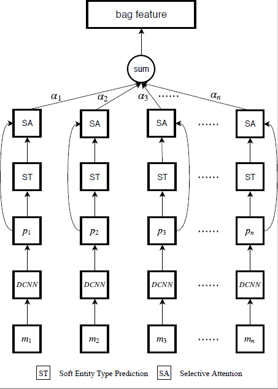
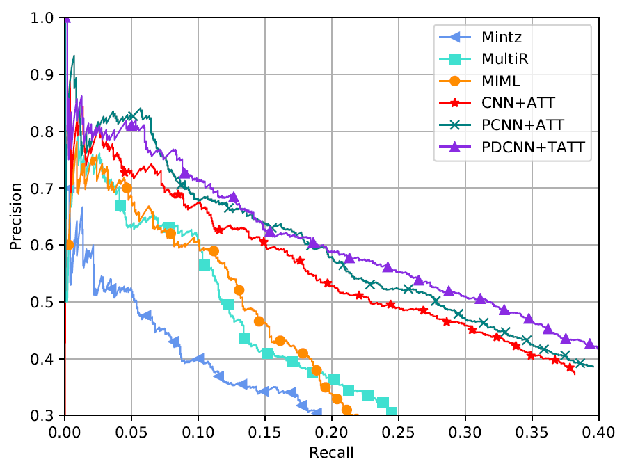
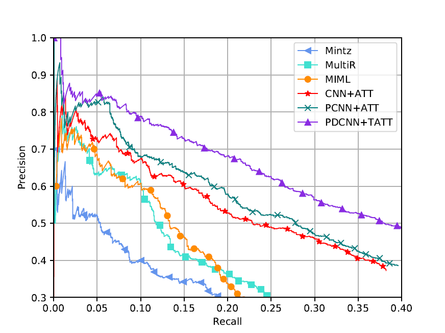

# Dilated Convolutional Networks Incorporating Soft Entity Type Constraints for Distant Supervised Relation Extraction

Source code for IJCNN 2019 paper: [Dilated Convolutional Networks Incorporating Soft Entity Type Constraints for Distant Supervised Relation Extraction]()

## Overview



The architecture of our model, where $m_i$ indicates the original sentence for an entity pair. $p_j$ indicates the sentence feature encoded by DCNNs. Before calculating attention weight $\alpha_i$ for mention mi, its entity types are dynamically ajusted via the model prediction and current type labels to denoise and acquire soft entity type. Taking soft entity types into account, $\alpha_i$ is specified to the entity types of $m_i$. Finally, weighted summation is applied on all sentence features for producing bag feature $\mathbf{b}$.

## Dependencies

* Pytorch 1.0.1
* tqdm 4.31.1
* scikit-learn 0.20.3
* Compatible with Python 3.X

## Dataset and Pretrained models

*  Like the paper "Neural Relation Extraction with Selective Attention over Instances", we use [Riedel NYT dataset](http://iesl.cs.umass.edu/riedel/ecml/) for evaluation.
*  Our dataset can be downloaded from [here](https://pan.baidu.com/s/1wtJ2aHcxzMxmWrVuJvtXrw), and extraction code is "e9zu".
*  Our models can be downloaded from [here](https://pan.baidu.com/s/1OVF2Mb8Kupm0oM0BiufznQ), and extraction code is "h37z".

## Training from scratch

* Options for preprocessing, traning and testing
  
  All options can be modified in `nre/options.py`

* Preprocessing the dataset:
  ```
  python preprocess.py
  ```

* Train the model:
  ```
  python train.py -batch_size 160 -model_type PDCNN+TATT -gpu_num 1
  ```
  After training, the trained model can be found in `ckpt` directory.

* Test the model:
  ```
  python test.py -batch_size 160 -model_type PDCNN+TATT -gpu_num 1 -pretrain_model ckpt/model_step_best.pt
  ```

## Evaluation Results

### Precision Recall Curve



### Precision@N

| P@N(%) | 100 | 200 | 300 | Mean |
|--------|:---:|:---:|:---:|:----:|
| CNN+AVE|67.3 | 64.7| 58.1| 63.4 |
| CNN+ATT|76.2 |68.6 | 59.8| 68.2 |
|PCNN+AVE|73.3 | 66.7| 62.8| 67.6|
|PCNN+ATT|76.2 | 73.1| 67.4| 72.2 |
|ResCNN-9|79.0 | 69.0| 61.0| 69.7 |
|DCNN+ATT|75.2|72.1|67.0|71.5|
|PDCNN+ATT|77.2|77.6|71.4|75.4|
|CNN+TATT|79.2|73.1|66.4|72.9|
|PCNN+TATT|76.2|73.1|68.4|72.6|
|DCNN+TATT|77.2|70.6|72.1|73.3|
|PDCNN+TATT|80.2|76.1|70.8|75.7|

### Supplements

We notice the training set used by Lin et al., 2016 has 522,611 sentences, while some recent works used the training set which has 570,088 sentences. For a fair comparison, we also conduct experiments on the latter. The following are the results:

#### Precision Recall Curve



#### Precision@N

| P@N(%) | 100 | 200 | 300 | Mean |
|--------|:---:|:---:|:---:|:----:|
|PDCNN+TATT|83.2|81.1|76.4|80.2|


## Citation:

Please cite the following paper if you use this code in your work.

```

```

For any clarification, please create an issue or contact huweilong@whu.edu.cn.